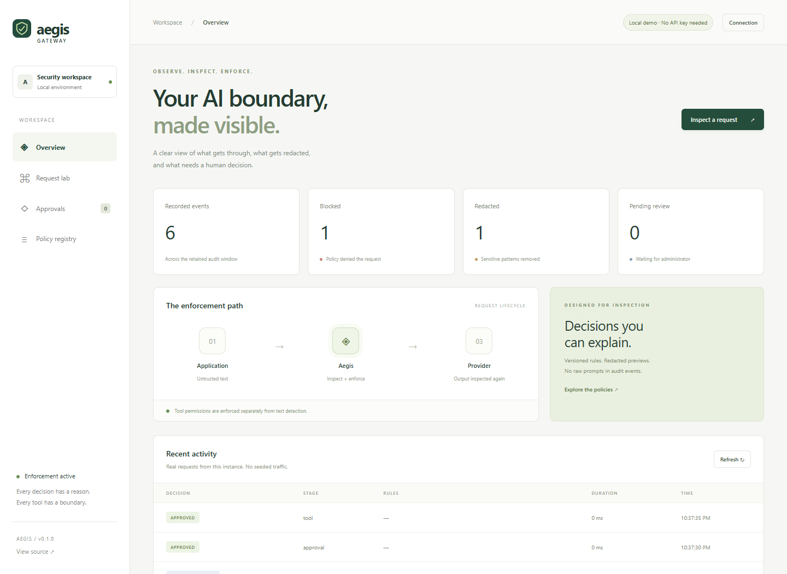

# Aegis Gateway

[](https://github.com/Taha1778/aegis-gateway/actions/workflows/ci.yml)

An inspectable AI security gateway for teams connecting applications to language models. It checks input/output text, redacts recognizable sensitive patterns, and requires explicit permission for tool actions.



## Try it locally

Requires **Node.js 24+**. No paid API is needed for the demonstration.

```sh
git clone https://github.com/Taha1778/aegis-gateway.git
cd aegis-gateway
npm ci
npm run dev
```

Open **http://127.0.0.1:4310** and choose **Request lab**. Try normal, injection, sensitive-data, and email-approval scenarios. For email approval, approve in **Approvals**, return to the lab, and consume authorization. No email is sent.

## Features

- Four explainable injection heuristics with Unicode compatibility normalization.
- Redaction of recognizable API tokens, private-key blocks, and email addresses.
- Scoped knowledge searches, administrator approval for email, and denial of other tools.
- Exact-call and credential binding, ten-minute expiry, and atomic single-use approval consumption.
- Responsive dashboard, SQLite metadata events, and redacted approval previews.
- Optional HTTPS provider adapter with timeout, response-size limits, and output inspection.

Applications must enforce tool decisions and prevent direct provider/tool bypass. Detection can miss attacks and block harmless text. This is a portfolio reference implementation, not production security certification. It does not scan binary files or execute tools.

## Verification

```sh
npm run check
npm run format:check
npm run build
npm audit
```

The synthetic corpus contains **48 cases**: 37 core regressions and 11 challenges. At policy version `2026-09-06.1`, core cases pass; challenges expose six missed attacks and five false positives. On the **39 injection/benign cases**, including challenges, precision is **76.2%** and recall **72.7%**. Nine cases test redaction separately. These are hand-authored regression results, not independent benchmarks or measurements of attacks against a model.

## Provider configuration

Copy `.env.example` to `.env` and set all three `UPSTREAM_*` variables for a provider you control:

```sh
npm run build
node --env-file=.env dist/server.js
```

The fixed endpoint must use HTTPS with no embedded credentials, query, or fragment. The adapter supports a limited text-only chat-completions schema; streaming and model tool calls are rejected. Live external-provider interoperability is unverified. See [the API contract](docs/api.md).

Protected mode requires distinct `GATEWAY_API_KEY` and `ADMIN_API_KEY` values of at least 24 characters. Both are required beyond loopback. Use TLS externally and restrict database access. Dashboard keys stay only in page memory.

## Container

Set both authentication keys and `HOST=0.0.0.0` in `.env`:

```sh
docker build -t aegis-gateway .
docker run --rm -p 127.0.0.1:4310:4310 --env-file .env -v aegis-data:/app/data aegis-gateway
```

The process runs as a non-root user. Named volumes preserve the database; bind mounts must be writable by UID 1000. Do not expose the unauthenticated demo through a public tunnel.

## Documentation

- [Architecture](docs/architecture.md) · [Threat model](docs/threat-model.md)
- [API reference](docs/api.md) · [Demo walkthrough](docs/demo.md)
- [Evaluation methodology](docs/evaluation.md)
- [Contributing](CONTRIBUTING.md) · [Security reporting](SECURITY.md)

Built with TypeScript, Fastify, Zod, Node SQLite, and a dependency-free browser UI. Design reference: [OWASP prompt-injection prevention guidance](https://cheatsheetseries.owasp.org/cheatsheets/LLM_Prompt_Injection_Prevention_Cheat_Sheet.html). Gemini assisted with the evaluation corpus, documentation, and CI draft; its output was reviewed and verified.
